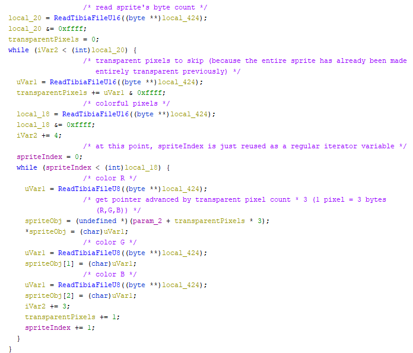

# Tibia71SprExtractor
Reverse engineered as part of a bigger project to learn more about the Tibia 7.1 client, mostly for fun.

Images at the end of the readme show how the Tibia client reads a single sprite.

### .spr structure
- U32 Version
- U16 Sprite count (SC)
- U32[SC] sprite start byte positions in file
- Sprite[SC] sprite structures

### Sprite structure:
- U8 Transparent R
- U8 Transparent G
- U8 Transparent B
- U16 Byte length
- PixelData[Byte length] Sequence of PixelData

### PixelData structure:
- U16 Amount of transparent pixels to skip ahead
- U16 Amount of colorful pixels to write before next PixelData or EOF
- Pixel[Colorful pixels]

### Pixel structure:
- U8 Red
- U8 Green
- U8 Blue

### Reading Tibia.spr:
Every sprite is 32x32.

	Read U32 version
	Read U16 SpriteCount
    Loop i = 0..SpriteCount - 1
		SpritePositions[i] = Read U32 byte pos of sprite in file
	Loop i = 0..SpriteCount - 1 
		If SpritePositions[i] < 1 Then Skip
		TransparentRed   = Read U8
		TransparentGreen = Read U8
		TransparentBlue  = Read U8
        SpriteEnd        = (Current byte position in file) + (Read U16 byte length)
		Sprite           = Create new Bitmap
		CurrentPixel     = 0
		Loop while current byte position in file < SpriteEnd
            TransparentPixelCount = Read U16
			CurrentPixel         += TransparentPixelCount
            ColorfulPixelCount    = Read U16
			Loop j = 0..ColorfulPixelCount
				Red   = Read U8
				Green = Read U8
				Blue  = Read U8
				X = CurrentPixel % 32
				Y = CurrentPixel / 32
				WritePixel(Sprite, X, Y, Red, Green, Blue)

### Credits
@jo3bingham -- fairly certain I read one of their threads about Tibia file structures on an OT forum (although for another version of the client, it was still very helpful)

Tibia.exe -- everything else

### Tibia.exe reading single sprite:
Initializating sprite:

Reading sprite:

